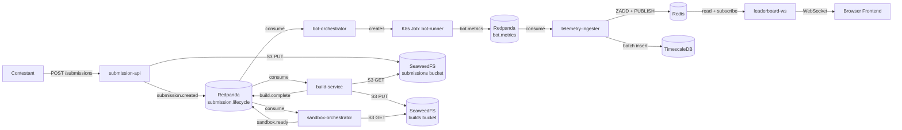

# Architecture

System-level overview of the OBARENA orderbook engine evaluation platform.

## Event Flow

```
contestant → submission-api → [Redpanda: submission.lifecycle] → build-service
build-service → [Redpanda: submission.lifecycle] → sandbox-orchestrator
sandbox-orchestrator → [Redpanda: submission.lifecycle] → bot-orchestrator
bot-orchestrator → K8s Job → bot-runner → [Redpanda: bot.metrics] → telemetry-ingester
telemetry-ingester → Redis ZADD → leaderboard-ws → frontend (WebSocket)
```



## Services

| Service | Namespace | Type | Replicas | Purpose |
|---------|-----------|------|----------|---------|
| submission-api | platform | Deployment | 2–10 (HPA) | Accept code submissions |
| build-service | platform | Deployment | 1–8 (HPA) | Compile submitted code |
| sandbox-orchestrator | platform | Deployment | 1–6 (HPA) | Deploy binaries as sandbox pods |
| bot-orchestrator | platform | Deployment | 1 (singleton) | Run bot test fleet |
| telemetry-ingester | platform | Deployment | 1–4 (HPA) | Score and store results |
| leaderboard-ws | platform | Deployment | 2–6 (HPA) | Serve live leaderboard |
| bot-runner | bots | Job | 1 per test | Execute correctness + load tests |
| sandbox | sandboxes | Pod | 1 per submission | Run contestant binary |
| build | builds | Pod | 1 per submission | Compile contestant code |

## Topic Topology

| Service | Reads | Writes |
|---------|-------|--------|
| submission-api | — | `submission.lifecycle` (`submission.created`) |
| build-service | `submission.lifecycle` (group: `build-service`) | `submission.lifecycle` (`build.complete`, `build.failed`) |
| sandbox-orchestrator | `submission.lifecycle` (group: `sandbox-orchestrator`) | `submission.lifecycle` (`sandbox.ready`, `sandbox.failed`) |
| bot-orchestrator | `submission.lifecycle` (group: `bot-orchestrator`) | `submission.lifecycle` (`test.complete`) |
| bot-runner | — | `bot.metrics` (`bot.metrics`) |
| telemetry-ingester | `bot.metrics` (group: `telemetry-ingester`) | — |
| leaderboard-ws | — | — |

## Namespace Isolation Model

| Namespace | Contents | Network Policy |
|-----------|----------|----------------|
| `platform` | All services, Redpanda, Redis, TimescaleDB, SeaweedFS | Default deny egress; explicit allow for DNS, K8s API, Redpanda, Redis, TimescaleDB, SeaweedFS, and all other namespaces |
| `builds` | Build pods (ephemeral) | Default deny egress (no network during compilation) |
| `sandboxes` | Sandbox pods (ephemeral) | Ingress from `bots` only; egress to SeaweedFS only |
| `bots` | Bot runner Jobs (ephemeral) | Egress to `sandboxes`, `platform` (Redpanda only), and DNS |

### Cross-Namespace Communication

```
platform services → builds namespace    : K8s API (create/manage build pods)
platform services → sandboxes namespace : K8s API (create/manage sandbox pods)
platform services → bots namespace      : K8s API (create/manage bot Jobs)
bots namespace → sandboxes namespace    : WebSocket (load test traffic)
bots namespace → platform namespace     : Redpanda (publish metrics)
sandboxes namespace → platform namespace: SeaweedFS (binary download, InitContainer only)
```

## Security Boundaries

### Sandbox Pod Security

Every sandbox pod (running contestant code) enforces:

| Control | Configuration |
|---------|--------------|
| User | `runAsUser: 65534` (nobody), `runAsNonRoot: true` |
| Privilege escalation | `allowPrivilegeEscalation: false` |
| Filesystem | `readOnlyRootFilesystem: true` |
| Capabilities | `drop: ["ALL"]` |
| Seccomp | `type: Localhost`, profile: `sandbox-seccomp.json` |
| AppArmor | `type: RuntimeDefault` |
| Service account | `automountServiceAccountToken: false` |
| Disk | EmptyDir with 256Mi limit at `/sandbox`, unlimited at `/tmp` |
| Network | Ingress from `bots` only, egress to SeaweedFS only |

### Build Pod Security

| Control | Configuration |
|---------|--------------|
| Network | Default deny egress (no internet access) |
| Workspace | EmptyDir with 512Mi limit |
| Restart | `Never` |

### Bot Runner Job Security

| Control | Configuration |
|---------|--------------|
| Network | Egress restricted to `sandboxes`, Redpanda, and DNS |
| Restart | `Never` |
| Backoff limit | 0 (no retries) |

## RBAC

| ServiceAccount | Namespace | Role | Scope | Permissions |
|---------------|-----------|------|-------|-------------|
| `sandbox-orchestrator` | platform | `sandbox-pod-manager` | `sandboxes` | pods: create/get/list/watch/delete, pods/log: get |
| `sandbox-orchestrator` | platform | `runtimeclass-reader` | cluster | runtimeclasses: get/list |
| `build-service` | platform | `build-pod-manager` | `builds` | pods: create/get/list/watch/delete, pods/exec: create, pods/log: get |
| `bot-orchestrator` | platform | `bot-job-manager` | `bots` | jobs: create/get/list/watch/delete, pods: get/list/watch, pods/log: get |

## Data Flow

```
Source Code (tar.gz)
  → submission-api uploads to SeaweedFS (submissions bucket)
  → build-service downloads from SeaweedFS
  → build-service compiles in isolated pod
  → build-service uploads binary to SeaweedFS (builds bucket)
  → sandbox-orchestrator downloads binary via InitContainer
  → sandbox pod executes binary

Metrics
  → bot-runner measures latency (hdrhistogram) and throughput
  → bot-runner publishes to Redpanda (bot.metrics topic)
  → telemetry-ingester consumes and computes composite score
  → telemetry-ingester writes to TimescaleDB (historical)
  → telemetry-ingester writes to Redis (live leaderboard)
  → leaderboard-ws reads Redis and pushes to frontend
```

## Infrastructure

| Component | Image | Purpose |
|-----------|-------|---------|
| Redpanda | `redpandadata/redpanda:v26.1.7` | Event streaming (Kafka-compatible) |
| Redis | `redis:8-alpine` | Live leaderboard + pub/sub |
| TimescaleDB | `timescale/timescaledb:latest-pg18` | Historical telemetry storage |
| SeaweedFS | `chrislusf/seaweedfs:latest` | S3-compatible object storage |

### Storage

| Volume | Size | Purpose |
|--------|------|---------|
| SeaweedFS | 10Gi | Source artifacts + compiled binaries |
| TimescaleDB | 10Gi | Telemetry events + submission scores |
| Build artifacts | 10Gi | (defined in Helm, purpose TBD) |
